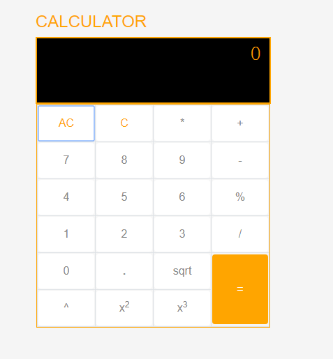

# Mathematical Calculator in Angular.
This is a simple component for performing arithmetic calculations using angular.
<p align="center">
    
</p>

**To preview demo of to do list project:** [Click here](https://stackblitz.com/edit/angular-x4kzo1-trjeto?embed=1&file=src/index.html&hideNavigation=1&view=preview)

## Using the complete angular project
Download the src folder and install the required packages and run the application.
### Installing

```
> npm install
```

### Run server

```
> ng serve
```


* we can do addition,subtraction,multiplication,division operations.


* we can do modulo Division and we can find Square root.


* we can know square and cube of a number.


* we can erase everything at a time by clicking AC(All Clear) and we can erase one by one which works as back space by clicking C(clear).


# Output
 @output is used to give required output to user.
EventEmitter is used so that whenever some event will be called user will get result. 
```
show(number){
console.log(number);
}
```
This method gives you the result.
#### <app-calculator (click)="show($event)"></app-calculator>
Here click is the output event name.


